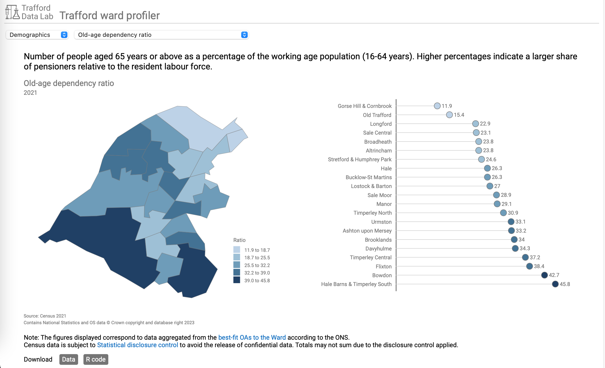

## Trafford ward profile

An app allowing users to visualise indicators for the 21 Trafford wards categorised by theme. The choropleth map and lollipop chart show how the indicator varies across Trafford. The <a href="https://github.com/traffordDataLab/ward_data" target="_blank">data</a> and the <a href="https://github.com/traffordDataLab/ward_data" target="_blank">R code</a> to obtain and clean the data are available to download using the buttons provided. The app includes a brief introduction to the wards.

 

 

The app can be viewed at <a href="https://www.trafforddatalab.io/ward_profiler/" target="_blank">https://www.trafforddatalab.io/ward_profiler/</a> and you can bookmark individual indicators.